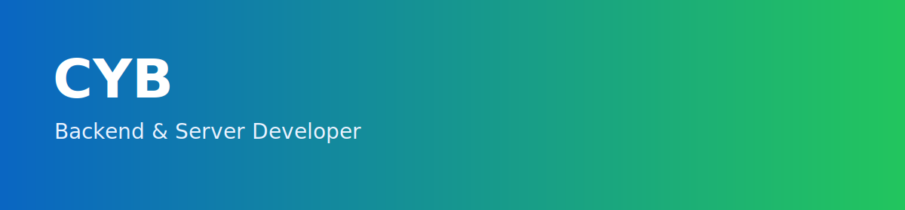



<!-- 움직이는 기술스택 아이콘 -->

## Stack

### Backend

### Database

### Tools

## Projects

### [WalkingMate](https://github.com/WalkingMate-dev/WalkingMate-Android)
로컬 음악 추천 및 BPM 기반 재생을 지원하는 걷기 보조 서비스 `WalkingMate`

### [Subook](https://github.com/USWBook/BookServer)
대학생 대상 중고 교재 거래 플랫폼 `Subook`

------------

  
  

## Contact
- GitHub: https://github.com/loTOCol
- Velog: https://velog.io/@cabbz3000/posts
- Email: cabbz987@naver.com

